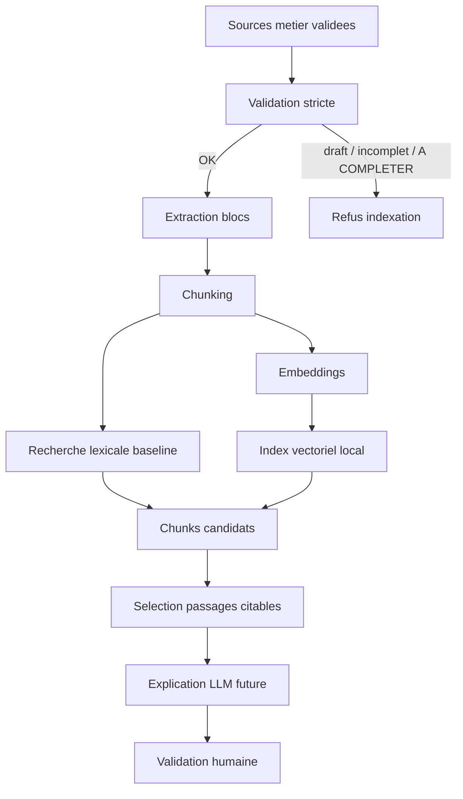
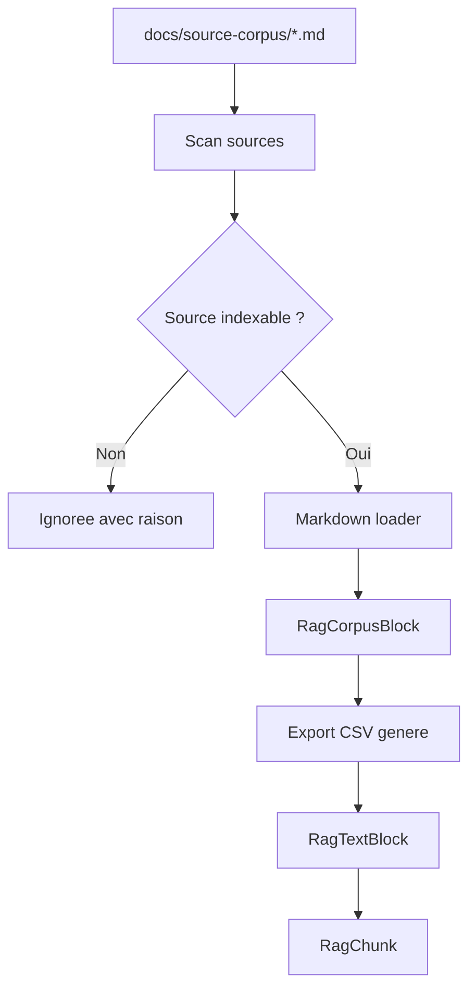
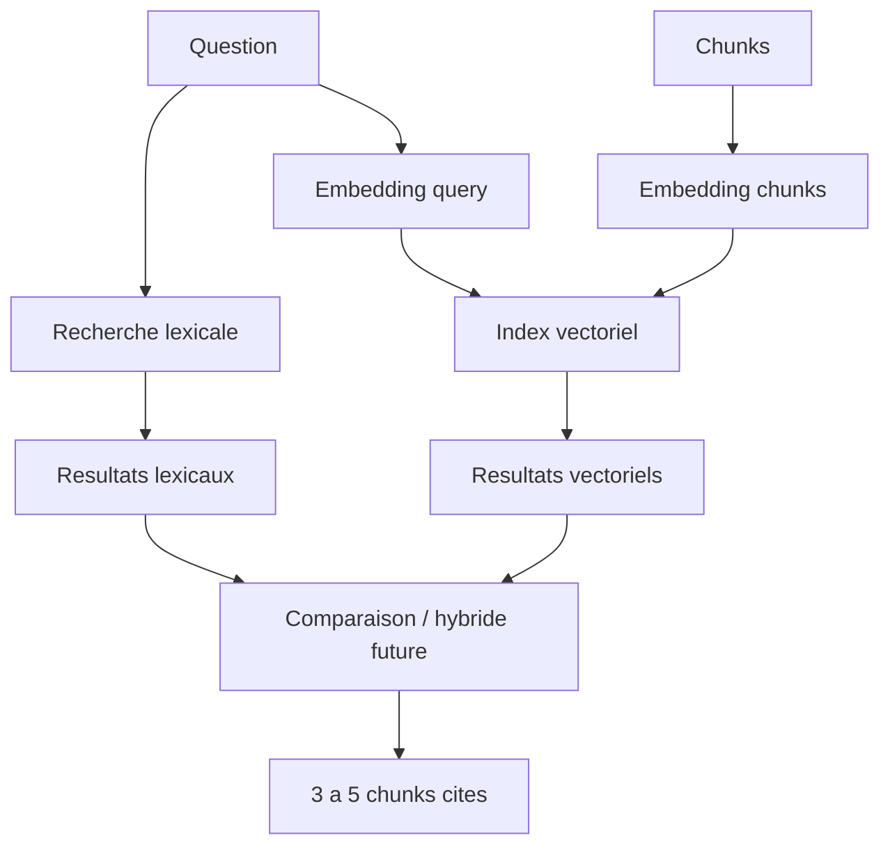
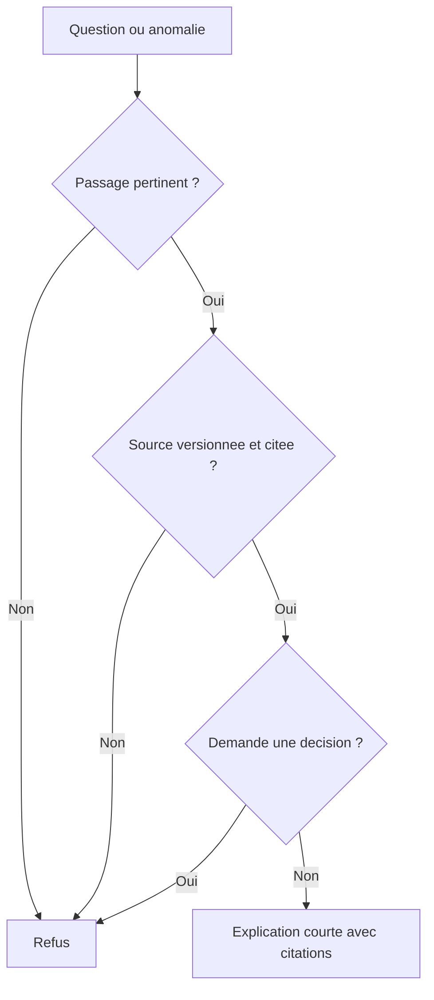
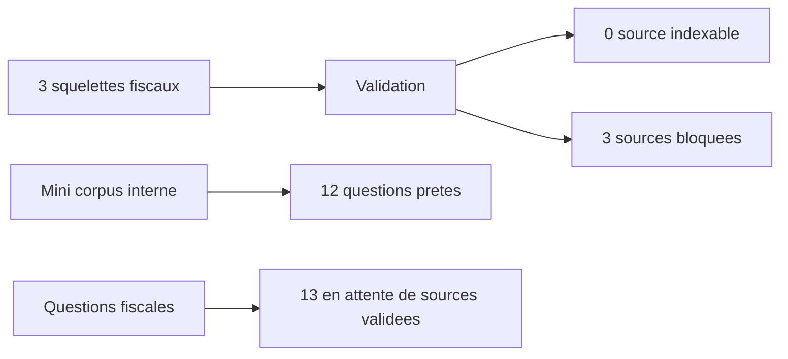

# Schemas Mermaid RAG

## Vue Globale

```mermaid
flowchart TD
    A[Sources metier validees] --> B[Validation stricte]
    B -->|OK| C[Extraction blocs]
    B -->|draft / incomplet / A COMPLETER| R[Refus indexation]
    C --> D[Chunking]
    D --> E[Recherche lexicale baseline]
    D --> F[Embeddings]
    F --> G[Index vectoriel local]
    E --> H[Chunks candidats]
    G --> H
    H --> I[Selection passages citables]
    I --> J[Explication LLM future]
    J --> K[Validation humaine]
```

## Preparation Corpus

```mermaid
flowchart TD
    A[docs/source-corpus/*.md] --> B[Scan sources]
    B --> C{Source indexable ?}
    C -->|Non| D[Ignoree avec raison]
    C -->|Oui| E[Markdown loader]
    E --> F[RagCorpusBlock]
    F --> G[Export CSV genere]
    G --> H[RagTextBlock]
    H --> I[RagChunk]
```

## Recherche

```mermaid
flowchart TD
    A[Question] --> B[Recherche lexicale]
    A --> C[Embedding query]
    D[Chunks] --> E[Embedding chunks]
    E --> F[Index vectoriel]
    C --> F
    B --> G[Resultats lexicaux]
    F --> H[Resultats vectoriels]
    G --> I[Comparaison / hybride future]
    H --> I
    I --> J[3 a 5 chunks cites]
```

## Garde-Fous

```mermaid
flowchart TD
    A[Question ou anomalie] --> B{Passage pertinent ?}
    B -->|Non| R[Refus]
    B -->|Oui| C{Source versionnee et citee ?}
    C -->|Non| R
    C -->|Oui| D{Demande une decision ?}
    D -->|Oui| R
    D -->|Non| E[Explication courte avec citations]
```

## Etat Actuel

```mermaid
flowchart LR
    A[3 squelettes fiscaux] --> B[Validation]
    B --> C[0 source indexable]
    B --> D[3 sources bloquees]
    E[Mini corpus interne] --> F[12 questions pretes]
    G[Questions fiscales] --> H[13 en attente de sources validees]
```

Le RAG explique uniquement. Il ne decide pas.
